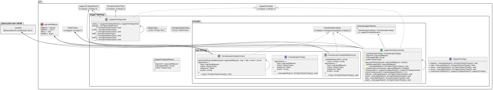

[](https://beecode.semaphoreci.com/projects/msh-logger)
[](https://codecov.io/gh/beecode-rs/msh-logger)
[](https://github.com/beecode-rs/msh-logger/blob/main/LICENSE)
[](https://nodei.co/npm/@beecode/msh-logger)

# @beecode/msh-logger

> Micro-service helper: logging abstraction using the Strategy Pattern

A TypeScript logging abstraction that decouples **formatting** from **transport**. Built on the Strategy Pattern with pluggable formatting strategies, transporting strategies, and ready-made presets for common setups.

<!-- toc -->

- [Install](#install)
- [Quick Start](#quick-start)
- [Architecture](#architecture)
  * [Diagram](#diagram)
  * [Format-Transport Separation](#format-transport-separation)
- [Log Levels](#log-levels)
- [Presets](#presets)
  * [PresetConsoleSimpleString](#presetconsolesimplestring)
  * [PresetConsoleJson](#presetconsolejson)
  * [PresetPino](#presetpino)
  * [PresetVoid](#presetvoid)
- [Formatting Strategies](#formatting-strategies)
  * [FormattingStrategySimpleString](#formattingstrategysimplestring)
  * [FormattingStrategyJson](#formattingstrategyjson)
- [Transporting Strategies](#transporting-strategies)
  * [TransportingStrategyConsole](#transportingstrategyconsole)
  * [TransportingStrategyPino](#transportingstrategypino)
  * [TransportingStrategyStream](#transportingstrategystream)
  * [TransportingStrategyVoid](#transportingstrategyvoid)
- [Custom LoggerStrategyBase](#custom-loggerstrategybase)
- [Creating Child Loggers (clone)](#creating-child-loggers-clone)
- [API Reference](#api-reference)
- [Migrating from v1 to v2](#migrating-from-v1-to-v2)
- [License](#license)

<!-- tocstop -->

## Install

```bash
npm i @beecode/msh-logger
```

## Quick Start

```typescript
import { LogLevel } from '@beecode/msh-logger'
import { PresetConsoleSimpleString } from '@beecode/msh-logger/controller/preset/console-simple-string'

const logger = new PresetConsoleSimpleString({ logLevel: LogLevel.INFO })

logger.debug('This is hidden') // filtered out (below INFO)
logger.info('Server started', { port: 3000 })
logger.warn('Deprecation warning')
logger.error('Something went wrong', new Error('boom'))
```

**Output:**

```
2026-05-30T12:00:00.000Z - INFO: Server started { port: 3000 }
2026-05-30T12:00:00.000Z - WARN: Deprecation warning
2026-05-30T12:00:00.000Z - ERROR: Something went wrong Error: boom
```

## Architecture

### Diagram



### Format-Transport Separation

The logger is built on two independent, composable strategy layers:

- **FormattingStrategy** — transforms log data (`level`, `meta`, `category`, `timestamp`) plus messages into structured `FormattedLog[]` objects.
- **TransportingStrategy** — receives `FormattedLog` objects and writes them to a destination (console, Pino, stream, etc.).

The `LoggerStrategyBase` composes one of each. **Presets** pre-wire common combinations so you don't have to think about the two layers individually.

```
src/
├── business/
│   ├── model/
│   │   └── log-level.ts                         # LogLevel enum
│   └── service/
│       ├── logger-strategy.ts                    # LoggerStrategy interface
│       ├── logger-strategy/
│       │   └── base.ts                           # LoggerStrategyBase
│       ├── formatting-strategy.ts                # FormattingStrategy interface
│       ├── formatting-strategy/
│       │   ├── simple-string.ts                  # FormattingStrategySimpleString
│       │   └── json.ts                           # FormattingStrategyJson
│       ├── transporting-strategy.ts              # TransportingStrategy interface
│       └── transporting-strategy/
│           ├── console.ts                        # TransportingStrategyConsole
│           ├── pino.ts                           # TransportingStrategyPino
│           ├── stream.ts                         # TransportingStrategyStream
│           └── void.ts                           # TransportingStrategyVoid
└── controller/preset/                       # Pre-wired presets
    ├── console-simple-string.ts             # PresetConsoleSimpleString
    ├── console-json.ts                      # PresetConsoleJson
    ├── pino.ts                              # PresetPino
    └── void.ts                              # PresetVoid
```

**Presets** (convenience wrappers):

| Preset | Formatting | Transporting |
|--------|-----------|-------------|
| `PresetConsoleSimpleString` | `FormattingStrategySimpleString` | `TransportingStrategyConsole` |
| `PresetConsoleJson` | `FormattingStrategyJson` | `TransportingStrategyConsole` |
| `PresetPino` | `FormattingStrategyJson` | `TransportingStrategyPino` |
| `PresetVoid` | — | — (no-op) |

## Log Levels

The `LogLevel` enum controls which messages are emitted. Higher numeric severity means more critical:

| Level | Value | Description |
|-------|-------|-------------|
| `LogLevel.FATAL` | 60 | Unrecoverable — the process must terminate |
| `LogLevel.ERROR` | 50 | Unexpected failure — a feature failed but the process can continue |
| `LogLevel.WARN` | 40 | Degraded behavior — unexpected but recoverable |
| `LogLevel.INFO` | 30 | Business-significant events — service started, user logged in |
| `LogLevel.DEBUG` | 20 | Diagnostic detail — request/response payloads, branching decisions |
| `LogLevel.TRACE` | 10 | Fine-grained flow — function entry/exit, variable dumps |

When a logger is created, it defaults to `LogLevel.ERROR` (most restrictive). Any log at or above the configured level is emitted; lower levels are silently dropped.

## Presets

Presets are the easiest way to get started. Each pre-wires a specific formatting + transporting combination.

### PresetConsoleSimpleString

Human-readable console output with timestamps. Good for local development.

```typescript
import { LogLevel } from '@beecode/msh-logger'
import { PresetConsoleSimpleString } from '@beecode/msh-logger/controller/preset/console-simple-string'

const logger = new PresetConsoleSimpleString({
  logLevel: LogLevel.DEBUG,
  category: 'my-app',
  meta: { service: 'api', version: '1.0.0' },
})
```

**Constructor params** (inherits `LoggerStrategyParams`, omits strategies):

| Param | Type | Default | Description |
|-------|------|---------|-------------|
| `logLevel` | `LogLevel` | `LogLevel.ERROR` | Minimum log level to emit |
| `category` | `string` | `undefined` | Category label added to every log entry |
| `meta` | `ObjectType` | `undefined` | Metadata attached to every log entry |

**Output format:**

```
2026-05-30T12:00:00.000Z - INFO: [my-app] Hello world
```

### PresetConsoleJson

JSON-formatted console output. Good for structured log ingestion.

```typescript
import { LogLevel } from '@beecode/msh-logger'
import { PresetConsoleJson } from '@beecode/msh-logger/controller/preset/console-json'

const logger = new PresetConsoleJson({
  logLevel: LogLevel.INFO,
  category: 'my-app',
  meta: { service: 'api' },
})
```

**Constructor params:** same as `PresetConsoleSimpleString`.

**Output format:**

```json
{"level":"INFO","timestamp":1748606400000,"category":"my-app","message":"Hello world"}
```

When `meta` is provided, it is spread into the JSON payload:

```json
{"service":"api","level":"INFO","timestamp":1748606400000,"category":"my-app","message":"Hello world"}
```

### PresetPino

Production-grade logging via [Pino](https://getpino.io/). Delegates formatting and transport to the Pino library.

```typescript
import { LogLevel } from '@beecode/msh-logger'
import { PresetPino } from '@beecode/msh-logger/controller/preset/pino'

const logger = new PresetPino({
  logLevel: LogLevel.INFO,
})
```

**Constructor params** (`PresetPinoParams`):

| Param | Type | Default | Description |
|-------|------|---------|-------------|
| `logLevel` | `LogLevel` | `LogLevel.ERROR` | Minimum log level to emit |
| `category` | `string` | `undefined` | Category label added to every log entry |
| `meta` | `ObjectType` | `undefined` | Metadata attached to every log entry |
| `pinoLogger` | `pino.Logger` | `pino()` | Custom Pino logger instance |

### PresetVoid

The default no-op logger. All log calls are silently ignored — useful for testing or disabling logging entirely.

```typescript
import { PresetVoid } from '@beecode/msh-logger/controller/preset/void'

const logger = new PresetVoid()

logger.info('This does nothing')
logger.error('Neither does this')
```

## Formatting Strategies

Formatting strategies transform raw log data into `FormattedLog[]` objects. Each `FormattedLog` contains a `level`, `message`, and optional `metadata`.

### FormattingStrategySimpleString

Human-readable format with timestamps. Produces messages like `2026-05-30T12:00:00.000Z - INFO: [category] message`.

```typescript
import { FormattingStrategySimpleString } from '@beecode/msh-logger/business/service/formatting-strategy/simple-string'

const formatter = new FormattingStrategySimpleString()
```

### FormattingStrategyJson

Structured JSON format. Extracts `message` from objects and spreads remaining keys into metadata.

```typescript
import { FormattingStrategyJson } from '@beecode/msh-logger/business/service/formatting-strategy/json'

const formatter = new FormattingStrategyJson()
```

## Transporting Strategies

Transporting strategies receive `FormattedLog` objects and write them to a destination.

### TransportingStrategyConsole

Writes to `console.*` methods, mapping log levels to the appropriate console function.

```typescript
import { TransportingStrategyConsole } from '@beecode/msh-logger/business/service/transporting-strategy/console'

const transport = new TransportingStrategyConsole()
```

### TransportingStrategyPino

Sends logs to a [Pino](https://getpino.io/) logger instance. Optionally inject a custom Pino logger; defaults to `pino()`.

```typescript
import { TransportingStrategyPino } from '@beecode/msh-logger/business/service/transporting-strategy/pino'

const transport = new TransportingStrategyPino() // uses default pino()
// or with a custom instance:
// const transport = new TransportingStrategyPino(customPinoLogger)
```

### TransportingStrategyStream

Writes JSON-stringified `FormattedLog` to any `NodeJS.WritableStream`. Useful for piping logs to files, HTTP streams, or custom destinations.

```typescript
import { createWriteStream } from 'node:fs'
import { TransportingStrategyStream } from '@beecode/msh-logger/business/service/transporting-strategy/stream'

const stream = createWriteStream('./app.log')
const transport = new TransportingStrategyStream(stream)
```

### TransportingStrategyVoid

No-op transport. Silently drops all logs.

```typescript
import { TransportingStrategyVoid } from '@beecode/msh-logger/business/service/transporting-strategy/void'

const transport = new TransportingStrategyVoid()
```

## Custom LoggerStrategyBase

Combine any formatting strategy with any transporting strategy to build a custom logger:

```typescript
import { LogLevel } from '@beecode/msh-logger'
import { LoggerStrategyBase } from '@beecode/msh-logger/business/service/logger-strategy/base'
import { FormattingStrategyJson } from '@beecode/msh-logger/business/service/formatting-strategy/json'
import { TransportingStrategyStream } from '@beecode/msh-logger/business/service/transporting-strategy/stream'
import { createWriteStream } from 'node:fs'

const logger = new LoggerStrategyBase({
  formattingStrategy: new FormattingStrategyJson(),
  transportingStrategy: new TransportingStrategyStream(createWriteStream('./app.log')),
  logLevel: LogLevel.DEBUG,
  category: 'my-service',
  meta: { env: 'production' },
})
```

**Constructor params** (`LoggerStrategyBaseParams`):

| Param | Type | Default | Description |
|-------|------|---------|-------------|
| `formattingStrategy` | `FormattingStrategy` | — *(required)* | Strategy for formatting log data |
| `transportingStrategy` | `TransportingStrategy` | — *(required)* | Strategy for transporting formatted logs |
| `logLevel` | `LogLevel` | `LogLevel.ERROR` | Minimum log level to emit |
| `category` | `string` | `undefined` | Category label added to every log entry |
| `meta` | `ObjectType` | `undefined` | Metadata attached to every log entry |

## Creating Child Loggers (clone)

Use `clone()` to create a child logger that inherits settings from a parent, with optional overrides:

```typescript
import { LogLevel } from '@beecode/msh-logger'
import { PresetConsoleSimpleString } from '@beecode/msh-logger/controller/preset/console-simple-string'

const parent = new PresetConsoleSimpleString({
  logLevel: LogLevel.INFO,
  category: 'app',
  meta: { service: 'api' },
})

// Child inherits everything, overrides category and adds meta
const child = parent.clone({
  category: 'app:router',
  meta: { route: '/users' },
})

child.info('User listed')
// Meta is shallow-merged: { service: 'api', route: '/users' }
```

## API Reference

Full API documentation is generated with TypeDoc and available in `resource/doc/api/`.

**Public exports** (from `@beecode/msh-logger`):

| Export | Kind | Description |
|--------|------|-------------|
| `LogLevel` | enum | Log level values: `FATAL`, `ERROR`, `WARN`, `INFO`, `DEBUG`, `TRACE` |
| `LoggerStrategy` | interface | Contract for all logger implementations |
| `LoggerStrategyParams` | type | Params for configuring loggers and `clone()` |
| `ObjectType` | type | `Record<string, unknown>` — metadata bag |

**Formatting types** (from `@beecode/msh-logger/business/service/formatting-strategy`):

| Export | Kind | Description |
|--------|------|-------------|
| `FormattedLog` | type | Intermediate structure: `{ level, message, metadata? }` |
| `FormattingStrategy` | interface | Contract for formatting strategies |

**Preset imports** (via subpath):

| Import path | Export |
|-------------|--------|
| `@beecode/msh-logger/controller/preset/console-simple-string` | `PresetConsoleSimpleString` |
| `@beecode/msh-logger/controller/preset/console-json` | `PresetConsoleJson` |
| `@beecode/msh-logger/controller/preset/pino` | `PresetPino` |
| `@beecode/msh-logger/controller/preset/void` | `PresetVoid` |

**Formatting strategy imports** (via subpath):

| Import path | Export |
|-------------|--------|
| `@beecode/msh-logger/business/service/formatting-strategy/json` | `FormattingStrategyJson` |
| `@beecode/msh-logger/business/service/formatting-strategy/simple-string` | `FormattingStrategySimpleString` |

**Transporting strategy imports** (via subpath):

| Import path | Export |
|-------------|--------|
| `@beecode/msh-logger/business/service/transporting-strategy/console` | `TransportingStrategyConsole` |
| `@beecode/msh-logger/business/service/transporting-strategy/pino` | `TransportingStrategyPino` |
| `@beecode/msh-logger/business/service/transporting-strategy/stream` | `TransportingStrategyStream` |
| `@beecode/msh-logger/business/service/transporting-strategy/void` | `TransportingStrategyVoid` |

**Base class import** (via subpath):

| Import path | Export |
|-------------|--------|
| `@beecode/msh-logger/business/service/logger-strategy/base` | `LoggerStrategyBase`, `LoggerStrategyBaseParams` |

## Migrating from v1 to v2

See [MIGRATION.md](MIGRATION.md) for a complete guide covering all breaking changes and code examples.

## License

[MIT](LICENSE)
